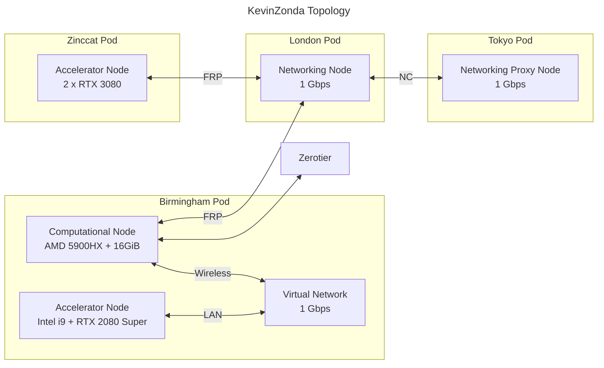
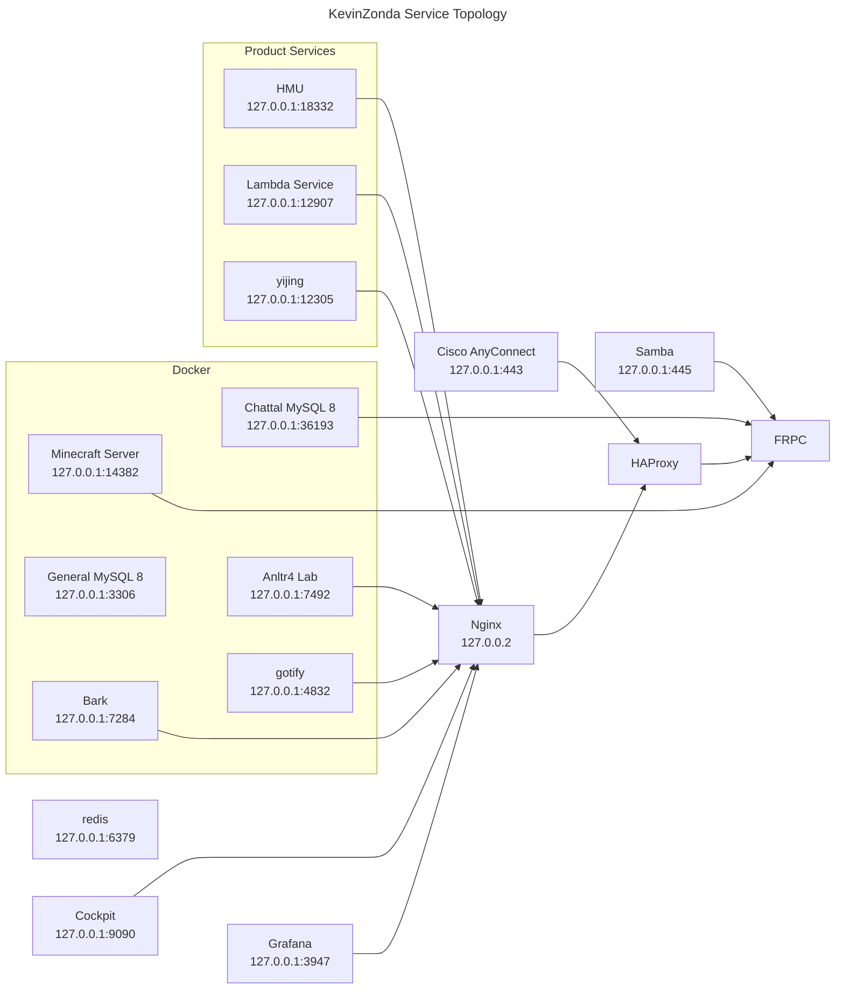

# KevinZonda Tools & Topology

## Pods Topology

```mermaid
---
title: KevinZonda Topology
---
flowchart LR
    subgraph BHAM["Birmingham Pod"]
        Comp1[Computational Node<br>AMD 5900HX + 16GiB]
        VNET1[Virtual Network<br>1 Gbps]
        Acc1[Accelerator Node<br>Intel i9 + RTX 2080 Super]

        Comp1 <-- Wireless --> VNET1
        Acc1  <-- LAN      --> VNET1
    end


    subgraph LON["London Pod"]
        NAT1[Networking Node<br>1 Gbps]
    end

    subgraph TKO["Tokyo Pod"]
        POX1[Networking Proxy Node<br>1 Gbps]
    end

    subgraph ZC["Zinccat Pod"]
        Acc2[Accelerator Node<br>2 x RTX 3080]
    end

    ZT[Zerotier]

    Comp1 <-- FRP --> NAT1
    Acc2  <-- FRP --> NAT1

    NAT1 <-- NC --> POX1

    Comp1 <--> ZT
```

## Services

```mermaid
---
title: KevinZonda Service Topology
---
flowchart LR
    grafana[Grafana<br>127.0.0.1:3947]
    smb[Samba<br>127.0.0.1:445]
    redis[redis<br>127.0.0.1:6379]
    
    anyconnect[Cisco AnyConnect<br>127.0.0.1:443]
    ngx[Nginx<br>127.0.0.2]
    cockpit[Cockpit<br>127.0.0.1:9090]
    haproxy[HAProxy]
    subgraph docker[Docker]
        direction LR
        mc[Minecraft Server<br>127.0.0.1:14382]
        mysql_ch[Chattal MySQL 8<br>127.0.0.1:36193]
        mysql_general[General MySQL 8<br>127.0.0.1:3306]
        bark[Bark<br>127.0.0.1:7284]
        antlr4[Anltr4 Lab<br>127.0.0.1:7492]
        gotify[gotify<br>127.0.0.1:4832]

        mysql_general ~~~ antlr4
        bark ~~~ gotify
        mc ~~~ mysql_ch
    end

    subgraph svc[Product Services]
        hmu[HMU<br>127.0.0.1:18332]
        lambda[Lambda Service<br>127.0.0.1:12907]
        yijing[yijing<br>127.0.0.1:12305]
    end

    frpc[FRPC]

    bark    --> ngx
    antlr4  --> ngx
    gotify  --> ngx
    grafana --> ngx
    cockpit --> ngx
    hmu     --> ngx
    lambda  --> ngx
    yijing  --> ngx

    cockpit ~~~ grafana

    ngx        --> haproxy
    anyconnect --> haproxy

    haproxy  --> frpc
    smb      --> frpc
    mysql_ch --> frpc
    mc       --> frpc
```

